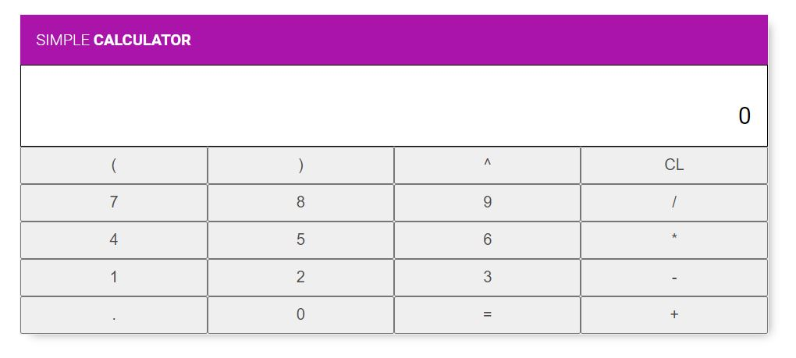
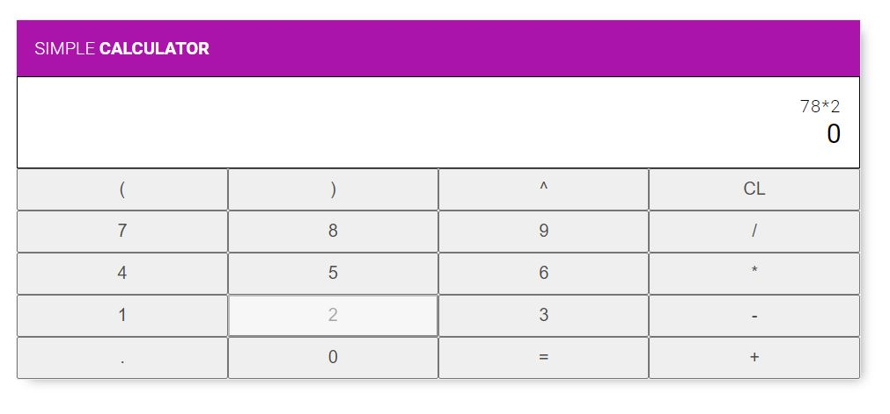
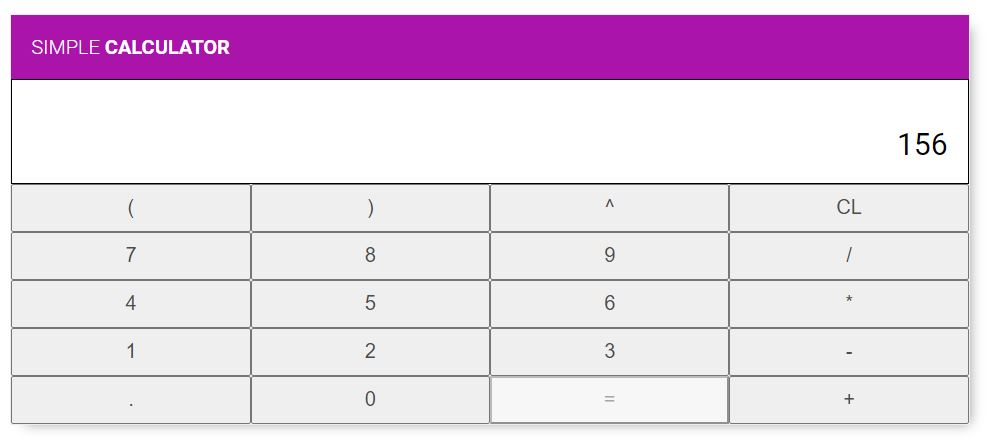
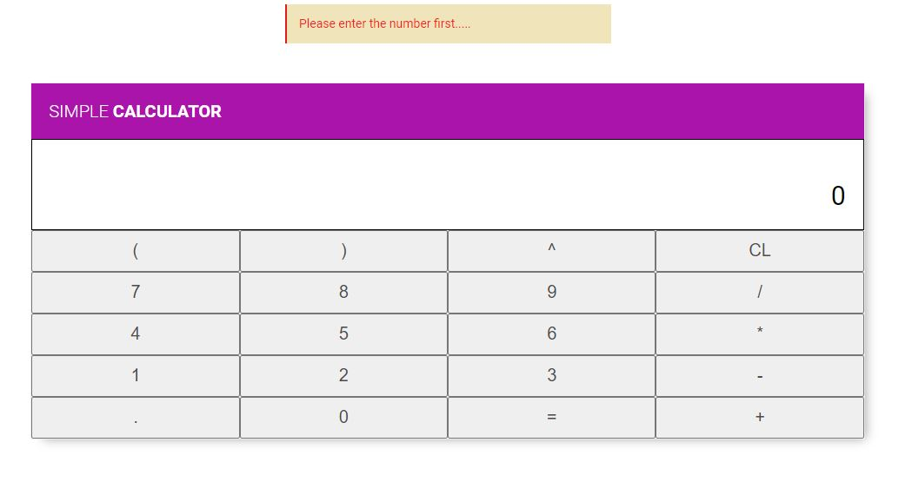

# react-app-simple-calculator
A simple Calculator Application using [React JS](https://reactjs.org/docs/getting-started.html), a JavaScript library to make awesome UI by Facebook.  

This application uses [React JS](https://reactjs.org/docs/getting-started.html) component oriented UI creation paradigm. All components are written in [JSX](https://reactjs.org/docs/jsx-in-depth.html) and ES6 style and are
combined using [Webpack 5](https://webpack.js.org/concepts/) to get the build for production purpose. 

[Babel](https://babeljs.io/docs/en/babel-preset-react) is used to *transpile* all [JSX](https://reactjs.org/docs/jsx-in-depth.html) code to vanilla JavaScript code. States and Props are used to pass data within components. To install all the dependecies `npm` is used.

For calculation of all the expressions [math.js](https://www.npmjs.com/package/mathjs) is used.


## Features
<ul>
 <li> Code is rewritten with <a href="https://reactjs.org/docs/getting-started.html" >React JS 17</a> </li>
 <li> Latest features of JavaScript i.e. ES6, ES7, ES8 is used </li>
 <li> <a href="https://reactjs.org/docs/hooks-intro.html">React JS Hooks</a> are used with Functional components
</ul>

- Enter an expression using the keypad layout shown in the application
- To get the result of the calculation / expression click the `=` button 
- It supports all the integer as well as floating point calculations
- Error messages would be shown if an symbol entered first
- As the web application is not backed by database / storage *no history of the calculation* is kept


## Installation

Clone the repository:
```
git clone https://github.com/krishanweb2206/React-Calc.git
```

Navigate inside the directory: 
```
cd React-Calc
```
Run the Application

```
npm start
````

## Screenshots

Some screens of the application is given below for better understanding. 

<p> Initial screen <br/> 
 
</p>
 
 <p> Entering an expression <br/>
 
 </p>
 
 <p> Result of the expression <br/> 
 
 </p>
 
 <p> Error screen <br/>
 
 </p>
 
 

